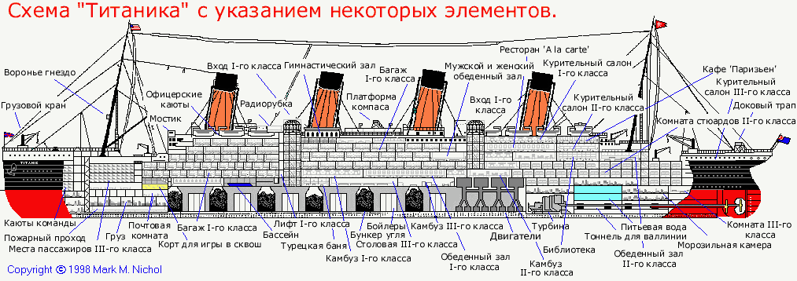

Данная статья описывает мою попытку создать модель для предсказания выживших пассажиров "Титаника". Основная задача - продемонстрировать некоторые инструменты используемые в Data Science. Модель создаётся в рамках соревнования [Titanic: Machine Learning from Disaster](https://www.kaggle.com/c/titanic) проходящего на сайте [Kaggle](https://www.kaggle.com).

В своей работе я буду использовать язык "R", как один из лучших бесплатных инструментов для анализа данных.

### Предпосылки для создания модели
Если доверять [Википедии](https://ru.wikipedia.org/wiki/%D0%A2%D0%B8%D1%82%D0%B0%D0%BD%D0%B8%D0%BA), то Титаник столкнулся с айсбергом в 11:40 вечера корабельного времени, когда подавляющее болшинство пассажиров и корабельной команды находились в своих каютах. Соответственно, расположение кают, возможно, имело влияние на вероятность выжить, т.к. пассажиры нижних палуб, во-первых, позднее узнали о столкновении и, соответственно, имели меньше времени добраться до верхней палубы. И, во-вторых, им, естественно, было дольше выбираться из помещений корабля. Ниже изображены схемы Титаника с указанием палуб и помещений.



Титаник являлся британским кораблем, а согласно законам Британии на корабле должно было быть число шлюпок, соответствующее водоизмещению судна, а не пассажировместимости. Титаник формально соответствовал этим требованиям и имел 20 шлюпок (14 со вместимостью 65 человек, 2 — 40 человек, 4 — 47 человек), которые были рассчитаны на погрузку 1178 человек, всего же на Титанике было 2208 человек. Таким образом, зная, что шлюпок на всех не хватит, капитан Титаника Смит отдал приказ брать на шлюпки только женщин и детей. Однако члены команды не всегда следовали ему.

### Получение данных
Kaggle предоставляет данные в виде двух файлов в формате csv:

- [`train.csv`](https://www.kaggle.com/c/titanic/download/train.csv) (содержит выборку пассажиров с известным исходом, т.е. выжил или нет)
- [`test.csv`](https://www.kaggle.com/c/titanic/download/test.csv)  (содержит другую выборку пассажиров без зависимой переменной)

Для получения данных в R я использую функцию `read_csv` из пакета `readr`. В сравнении с базовыми функциями данный пакет предоставляет ряд преимуществ, в частности: более высокую скорость и понятные названия параметров.
```{r message=FALSE} 
require(readr)
data_train <- read_csv("train.csv")
data_test <- read_csv("test.csv")
```
Посмотрим, что у нас получилось:
```{r}
str(data_train)
```


### Анализ данных
Исследовательский анализ данных, как я считаю, является одной из наиболее важных частей работы Data Scientist's, т.к., кроме непосредственно преобразования "сырых" данных в готовые для создания модели, часто во время этого процесса можно увидеть скрытые зависимости, благодаря использованию которых и получаются наиболее точные модели.

Для начала посмотрим на отсутствующие данные. В предоставленных данных часть отсутствующей информации была отмечена символом `NA` и при загрузке были по умолчанию преобразованы в особый символ `NA`. Но среди символьных переменных много пассажиров с пропущенными переменными, которые не были отмечены. Проверим их наличие используя возможности пакетов `magrittr` и `dplyr`
```{r message=FALSE}
require(magrittr)
require(dplyr)
data_train %>% select(Name, Sex, Ticket, Cabin, Embarked) %>% apply(., 2, function(column) sum(column == ""))
```

Заменим пропуски на `NA`, используя функцию `recode` из пакета `car`
```{r message=FALSE}
require(car)
data_train$Cabin <- recode(data_train$Cabin, "'' = NA")
data_train$Embarked <- recode(data_train$Embarked, "'' = NA")
```

Для графического представления  удобно использовать функцию `missmap` из пакета для работы с отсутствующими данными `Amelia`.
```{r message=FALSE, warning=F}
require(colorspace)
colors_A <- sequential_hcl(2)
require(Amelia)
missmap(data_train, col = colors_A, legend=FALSE)
```

Таким образом пропущенно около 20% данных в переменной `Age` и почти 80% в `Cabin`. И если с возрастом пассажиров можно провести обоснованное замещение пропущенных значений, в связи с небольшой их долей, то с каютами маловероятно что-то получится сделать, т.к. пропущенных значений существенно больше нежели заполненных.

К пропущенным значениям мы вернёмся позднее, а пока посмотрим какую информацию можно извлечь из тех данных, которые мы имеем. Напоминаю, что основная задача - определить переменные, влияющие на вероятность выжить при крушении Титаника. Попробуем это сделать при графиков.


