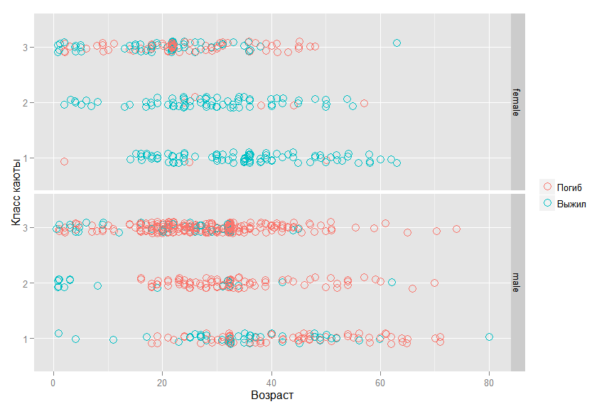

# Титаник. Модель прогнозирования вероятности выжить при крушении.
Морозов Глеб  
10 августа 2015 г.  

Данная работа описывает мою попытку создать модель для предсказания выживших пассажиров "Титаника". Основная задача - тренировка в использовании инструментов применяемых в Data Science для анализа данных и презентации результатов исследования. Основное внимание уделено исследовательскому анализу(exploratory research) и работе по созданию и выбору предикторов(feature engineering).  Модель создаётся в рамках соревнования [Titanic: Machine Learning from Disaster](https://www.kaggle.com/c/titanic) проходящего на сайте [Kaggle](https://www.kaggle.com).

В своей работе я буду использовать язык "R".

### Предпосылки для создания модели
Если доверять [Википедии](https://ru.wikipedia.org/wiki/%D0%A2%D0%B8%D1%82%D0%B0%D0%BD%D0%B8%D0%BA), то Титаник столкнулся с айсбергом в 11:40 вечера корабельного времени, когда подавляющее болшинство пассажиров и корабельной команды находились в своих каютах. Соответственно, расположение кают, возможно, имело влияние на вероятность выжить, т.к. пассажиры нижних палуб, во-первых, позднее узнали о столкновении и, соответственно, имели меньше времени добраться до верхней палубы. И, во-вторых, им, естественно, было дольше выбираться из помещений корабля. Ниже изображены схемы Титаника с указанием палуб и помещений.


Титаник являлся британским кораблем, а согласно законам Британии на корабле должно было быть число шлюпок, соответствующее водоизмещению судна, а не пассажировместимости. Титаник формально соответствовал этим требованиям и имел 20 шлюпок (14 со вместимостью 65 человек, 2 — 40 человек, 4 — 47 человек), которые были рассчитаны на погрузку 1178 человек, всего же на Титанике было 2208 человек. Таким образом, зная, что шлюпок на всех не хватит, капитан Титаника Смит отдал приказ брать на шлюпки только женщин и детей. Однако члены команды не всегда следовали ему.

### Получение данных
Kaggle предоставляет данные в виде двух файлов в формате csv:

- [`train.csv`](https://www.kaggle.com/c/titanic/download/train.csv) (содержит выборку пассажиров с известным исходом, т.е. выжил или нет)
- [`test.csv`](https://www.kaggle.com/c/titanic/download/test.csv)  (содержит другую выборку пассажиров без зависимой переменной)

Для получения данных в R я использую функцию `read_csv` из пакета `readr`. В сравнении с базовыми функциями данный пакет предоставляет ряд преимуществ, в частности: более высокую скорость и понятные названия параметров.


```r
require(readr)
data_train <- read_csv("train.csv")
data_test <- read_csv("test.csv")
```
Посмотрим, что у нас получилось:


```r
str(data_train)
```

```
## Classes 'tbl_df', 'tbl' and 'data.frame':	891 obs. of  12 variables:
##  $ PassengerId: int  1 2 3 4 5 6 7 8 9 10 ...
##  $ Survived   : int  0 1 1 1 0 0 0 0 1 1 ...
##  $ Pclass     : int  3 1 3 1 3 3 1 3 3 2 ...
##  $ Name       : chr  "Braund, Mr. Owen Harris" "Cumings, Mrs. John Bradley (Florence Briggs Thayer)" "Heikkinen, Miss. Laina" "Futrelle, Mrs. Jacques Heath (Lily May Peel)" ...
##  $ Sex        : chr  "male" "female" "female" "female" ...
##  $ Age        : num  22 38 26 35 35 NA 54 2 27 14 ...
##  $ SibSp      : int  1 1 0 1 0 0 0 3 0 1 ...
##  $ Parch      : int  0 0 0 0 0 0 0 1 2 0 ...
##  $ Ticket     : chr  "A/5 21171" "PC 17599" "STON/O2. 3101282" "113803" ...
##  $ Fare       : num  7.25 71.28 7.92 53.1 8.05 ...
##  $ Cabin      : chr  "" "C85" "" "C123" ...
##  $ Embarked   : chr  "S" "C" "S" "S" ...
```


### Анализ данных
Исследовательский анализ данных, как я считаю, является одной из наиболее важных частей работы Data Scientist's, т.к., кроме непосредственно преобразования "сырых" данных в готовые для создания модели, часто во время этого процесса можно увидеть скрытые зависимости, благодаря использованию которых и получаются наиболее точные модели.

Для начала посмотрим на отсутствующие данные. В предоставленных данных часть отсутствующей информации была отмечена символом `NA` и при загрузке были по умолчанию преобразованы в особый символ `NA`. Но среди символьных переменных много пассажиров с пропущенными переменными, которые не были отмечены. Проверим их наличие используя возможности пакетов `magrittr` и `dplyr`


```r
require(magrittr)
require(dplyr)
data_train %>% select(Name, Sex, Ticket, Cabin, Embarked) %>% apply(., 2, function(column) sum(column == ""))
```

```
##     Name      Sex   Ticket    Cabin Embarked 
##        0        0        0      687        2
```

Заменим пропуски на `NA`, используя функцию `recode` из пакета `car`


```r
require(car)
data_train$Cabin <- recode(data_train$Cabin, "'' = NA")
data_train$Embarked <- recode(data_train$Embarked, "'' = NA")
```

Для графического представления  удобно использовать функцию `missmap` из пакета для работы с отсутствующими данными `Amelia`.


```r
require(colorspace)
colors_A <- sequential_hcl(2)
require(Amelia)
missmap(data_train, col = colors_A, legend=FALSE)
```

 

Таким образом пропущенно около 20% данных в переменной `Age` и почти 80% в `Cabin`. И если с возрастом пассажиров можно провести обоснованное замещение пропущенных значений, в связи с небольшой их долей, то с каютами маловероятно что-то получится сделать, т.к. пропущенных значений существенно больше нежели заполненных. Пропущенные значения в признаке `Embarked` 

К пропущенным значениям мы вернёмся позднее, а пока посмотрим какую информацию можно извлечь из тех данных, которые мы имеем. Напоминаю, что основная задача - определить переменные, влияющие на вероятность выжить при крушении Титаника. Попробуем получить начальные представления об этих зависимостях с помощью простых графиков. 


```r
## Для создания графиков в этом исследовании я буду стараться использовать пакет 'ggplot2'
require(ggplot2)
require(gridExtra)
data_train %<>% transform(., Survived = as.factor(Survived),
                          Pclass = as.factor(Pclass), 
                          Sex = as.factor(Sex),
                          Embarked = as.factor(Embarked),
                          SibSp = as.numeric(SibSp))
colours <- rainbow_hcl(4, start = 30, end = 300)

ggbar <- ggplot(data_train) + geom_bar(stat = "bin", width=.6, fill= colours[3], colour="black") +
        guides(fill=FALSE) + ylab(NULL)
g1 <- ggbar + aes(x = factor(Survived, labels = c("Погиб", "Выжил"))) + 
        ggtitle("Распределение погибших\n и спасшихся пассажиров") + xlab(NULL)
g2 <- ggbar + aes(x = factor(Pclass, labels = c("Первый", "Второй", "Третий"))) + 
        ggtitle("Распределение пассажиров\n по классам обслуживания") + xlab(NULL)
g3 <- ggbar + aes(x = factor(Sex, labels = c("Женщина", "Мужчина"))) + 
        ggtitle("Распределение пассажиров между полами") + xlab(NULL)
g4 <- ggbar + aes(x = as.factor(SibSp)) + 
        ggtitle("Распределение пассажиров по сумме\n 'супруг + братья и сёстры на борту корабля'") + 
        xlab(NULL)
g5 <- ggbar + aes(x = as.factor(Parch)) + 
        ggtitle("Распределение пассажиров по сумме\n 'родители + дети на борту'") + xlab(NULL)
g6 <- ggbar + aes(x = factor(Embarked, labels = c("Cherbourg", "Queenstown", "Southampton"))) +
        ggtitle("Распределение пассажиров\n по пункту отправления") + 
        xlab(NULL)

gghist <- ggplot(data_train) + geom_histogram(fill= colours[4]) + guides(fill=FALSE) + ylab(NULL)
g7 <- gghist + aes(x = Age) + xlab(NULL) + ggtitle("Распределение пассажиров по возрастам")
g8 <- gghist + aes(x = Fare) + xlab(NULL) + ggtitle("Распределение пассажиров\n по стоимости билетов") 
grid.arrange(g1, g2, g3, g4, g5, g6, g7, g8, ncol = 2, nrow=4)
```

 

Уже можно делать первые выводы:

- больше пассажиров погибло чем спаслось
- подавляющее большинство пассажиров находилось в каютах третьего класса
- мужчин было больше чем женщин
В целом, уже можно сказать, что основными факторами модели будет пол пассажира (вспомним приказ капитана, про который я писал ранее) и расположение каюты.

Ненадолго вернёмся к пропущенным значениям. Из графика `Распределение пассажиров по пункту отправления` очевидно, что большинство пассажиров отправлялось из `Southampton`, соответственно можно спокойно заменить 2 `NA` этим значением


```r
data_train$Embarked[is.na(data_train$Embarked)] <- "S"
```

Теперь подробнее посмотрим на взаимоотношения между вероятностью выжить и другими факторами. Следующий график подтверждает теорию, что чем выше класс каюты пассажира - тем больше шансы выжить. (Под "выше"" я имею ввиду обратный порядок, т.к. первый класс выше чем второй и, тем более, третий.)


```r
ggbar <- ggplot(data_train) + geom_bar(stat = "bin", width=.6)
ggbar + aes(x = factor(Pclass, labels = c("Первый", "Второй", "Третий")),
            fill = factor(Survived, labels = c("Погиб", "Выжил"))) + 
        scale_fill_manual (values=colours[]) +
        guides(fill=guide_legend(title=NULL)) + 
        ylab(NULL) + xlab("Класс каюты")
```

 

Сравним шансы выжить у мужчин и женщин. Данные подтверждают теорию, высказанную ранее.


```r
ggbar + aes(x = factor(Sex, labels = c("Женщина", "Мужчина")),
            fill = factor(Survived, labels = c("Погиб", "Выжил"))) +
        scale_fill_manual (values=colours[]) +
        guides(fill=guide_legend(title=NULL)) + 
        ylab(NULL) + xlab("Пол пассажира")
```

 

Теперь взглянем на шансы выжить у пассажиров из различных портов отправления.

```r
ggbar + aes(x = factor(Embarked, labels = c("Cherbourg", "Queenstown", "Southampton")),
            fill = factor(Survived, labels = c("Погиб", "Выжил"))) +
        scale_fill_manual (values=colours[]) +
        guides(fill=guide_legend(title=NULL)) + 
        ylab(NULL) + xlab("Порт отправления")
```

 

Вроде бы просматривается какая-то связь, но я считаю, что это скорее связано с распределением пассажиров разных классов между этими портами, что и подтверждает следующий график.

```r
ggbar + aes(x = factor(Embarked, labels = c("Cherbourg", "Queenstown", "Southampton")),
            fill = factor(Pclass, labels = c("Первый", "Второй", "Третий"))) +
        scale_fill_manual (values=colours[]) +
        guides(fill=guide_legend(title="Класс каюты")) + 
        ylab(NULL) + xlab("Порт отправления")
```

 

Также можно проверить гипотезу, что выживают более молодые, т.к. они быстрее двигаются, лучше плавают и т.д.


```r
ggplot(data_train, aes(x = factor(Survived, labels = c("Погиб", "Выжил")), 
                       y = Age, fill = factor(Survived, labels = c("Погиб", "Выжил")))) +
        geom_boxplot() + scale_fill_manual (values=colours[]) +
        guides(fill=guide_legend(title=NULL)) + 
        ylab(NULL) + xlab(NULL)
```

 

Как видно, явная зависимость здесь не просматривается.

Теперь при помощи другого вида графика посмотрим на наличие возможных статистических связей между признаками объектов. Можно сделать предварительные выводы, которые подтверждают мысли высказанные ранее. В частности, что шансы выжить уменьшаются с ростом класса и возраст - очень слабый признак для построения модели. Также можно обнаружить и другие закономерности. Между возрастом и классом существует отрицательная корреляция, что, скорее всего, связано с более возрастные пассажиры чаще могли себе позволить более дорогую каюту. Кроме того, стоимость билета и класс тесно связаны (высокий коэффициент корреляции), что вполне ожидаемо.

```r
source('my.plotcorr.R')
corplot_data <- data_train %>% 
        select(Survived, Pclass, Sex, Age, SibSp, Parch, Fare, Embarked) %>%
        mutate(Survived = as.numeric(Survived), Pclass = as.numeric(Pclass),
               Sex = as.numeric(Sex), Embarked = as.numeric(Embarked))
corr_train_data <- cor(corplot_data, use = "na.or.complete")
colsc <- c(rgb(241, 54, 23, maxColorValue=255), 'white', rgb(0, 61, 104, maxColorValue=255))
colramp <- colorRampPalette(colsc, space='Lab')
colorscor <-  colramp(100)
my.plotcorr(corr_train_data, col=colorscor[((corr_train_data + 1)/2) * 100],
            upper.panel="number", mar=c(1,2,1,1), main='Корреляция между признаками')
```

 

Вернёмся к пропущенным значениям в данных. Один из обычных способов борьбы с ними - это замена на среднее от доступных значении того же признака. Например, 177 пропущенных из признака `Age` можно заменить на 29.7 

```r
summary(data_train$Age)
```

```
##    Min. 1st Qu.  Median    Mean 3rd Qu.    Max.    NA's 
##    0.42   20.12   28.00   29.70   38.00   80.00     177
```

Такой способ я уже успешно применял раннее с признаком `Embarked`, но там было всего две замены, а здесь же - 177, что составляет более 20% от всех имеющихся данных по этому признаку. Поэтому, стоит найти более точный способ замены.

Один из возможных вариантов - это взять среднее, но в зависимости от класса каюты, т.к., если посмотреть на график, расположенный ниже, то такая взаимосвязь возможно. И, если подумать, то такое предположение интуитивно понятно: чем старше человек - тем его вероятное благосостояние выше и, соответственно, выше и тот уровень комфорта, который он может себе позволить. Таким образом, можно заменить пропущенное значение для пассажира, например из третьего класса, средним возрастом для этого класса, что уже будет большим прогрессом, по сравнению с просто средним по всем пассажирам.

```r
ggplot(data_train, aes(x = factor(Pclass, labels = c("Первый", "Второй", "Третий")), 
                       y = Age, fill = factor(Pclass))) + 
        geom_boxplot() + scale_fill_manual (values=colours) + 
        ylab("Возраст") + xlab("Класс каюты") + guides(fill=FALSE)
```

 

Но давайте обратимся к другому из возможных вариантов замены пропущенных значений признака `Age`. Если посмотреть на значения признака `Name`, то можно заметить интересную особенность.

```r
head(data_train$Name)
```

```
## [1] "Braund, Mr. Owen Harris"                            
## [2] "Cumings, Mrs. John Bradley (Florence Briggs Thayer)"
## [3] "Heikkinen, Miss. Laina"                             
## [4] "Futrelle, Mrs. Jacques Heath (Lily May Peel)"       
## [5] "Allen, Mr. William Henry"                           
## [6] "Moran, Mr. James"
```

Имя каждого пассажира построено каждый раз по одному паттерну: "Фамилия, [Гоноратив](https://goo.gl/1J9vnC). Имя". Обращение `Master` в 19 веке применялость по отношению к детям мужского пола, соответственно, это можно использовать для выделения более узких и точных групп по возрасту. А `Miss` применялось по отношению к незамужним женщинам, но в 19 веке незамужними были, в подавляющем большинстве, только молодые девушки и девочки. Для того, чтобы использовать эту зависимость создадим новый признак `Title`.

```r
require(stringr)
data_train$Title <-  data_train$Name %>% str_extract(., "\\w+\\.") %>% str_sub(.,1, -2)
unique(data_train$Title)
```

```
##  [1] "Mr"       "Mrs"      "Miss"     "Master"   "Don"      "Rev"     
##  [7] "Dr"       "Mme"      "Ms"       "Major"    "Lady"     "Sir"     
## [13] "Mlle"     "Col"      "Capt"     "Countess" "Jonkheer"
```

Теперь определим титулы, среди владельцов которых есть хотя бы один с отсутствующим возрастом.

```r
mean_title <- data_train %>% group_by(Title) %>% 
        summarise(count = n(), Missing = sum(is.na(Age)), Mean = round(mean(Age, na.rm = T), 2))
mean_title
```

```
## Source: local data frame [17 x 4]
## 
##       Title count Missing  Mean
## 1      Capt     1       0 70.00
## 2       Col     2       0 58.00
## 3  Countess     1       0 33.00
## 4       Don     1       0 40.00
## 5        Dr     7       1 42.00
## 6  Jonkheer     1       0 38.00
## 7      Lady     1       0 48.00
## 8     Major     2       0 48.50
## 9    Master    40       4  4.57
## 10     Miss   182      36 21.77
## 11     Mlle     2       0 24.00
## 12      Mme     1       0 24.00
## 13       Mr   517     119 32.37
## 14      Mrs   125      17 35.90
## 15       Ms     1       0 28.00
## 16      Rev     6       0 43.17
## 17      Sir     1       0 49.00
```
И проведём замену. Для этого создадим функцию и применим её к признаку `Age`. 

```r
impute.mean <- function (impute_col, filter_var, var_levels) {
        for (lev in var_levels) { 
                impute_col[(filter_var == lev) & is.na(impute_col)] <-
                        mean(impute_col[filter_var == lev], na.rm = T)
        }
        return (impute_col)
}
data_train$Age <- impute.mean(data_train$Age, data_train$Title, c("Dr", "Master", "Mrs", "Miss", "Mr"))
summary(data_train$Age)
```

```
##    Min. 1st Qu.  Median    Mean 3rd Qu.    Max. 
##    0.42   21.77   30.00   29.75   35.90   80.00
```

Если обратить внимание на признак `Fare`(стоимость билета), то можно увидеть, что есть билеты с нулевой стоимостью.

```r
head(table(data_train$Fare))
```

```
## 
##      0 4.0125      5 6.2375 6.4375   6.45 
##     15      1      1      1      1      1
```

Первое объяснение, которое приходит в голову - это дети, но, если посмотреть на другие признаки этих пассажиров, то данное предположение оказывается ложным.

```r
data_train %>% filter(Fare < 6) %>% select(Fare, Age, Pclass, Title) %>% arrange(Fare)
```

```
##      Fare      Age Pclass    Title
## 1  0.0000 36.00000      3       Mr
## 2  0.0000 40.00000      1       Mr
## 3  0.0000 25.00000      3       Mr
## 4  0.0000 32.36809      2       Mr
## 5  0.0000 19.00000      3       Mr
## 6  0.0000 32.36809      2       Mr
## 7  0.0000 32.36809      2       Mr
## 8  0.0000 32.36809      2       Mr
## 9  0.0000 49.00000      3       Mr
## 10 0.0000 32.36809      1       Mr
## 11 0.0000 32.36809      2       Mr
## 12 0.0000 32.36809      2       Mr
## 13 0.0000 39.00000      1       Mr
## 14 0.0000 32.36809      1       Mr
## 15 0.0000 38.00000      1 Jonkheer
## 16 4.0125 20.00000      3       Mr
## 17 5.0000 33.00000      1       Mr
```

Поэтому, я думаю, что будет логично заменить нулевые значения на средние для класса, используя уже использовавшуюся функцию `impute.mean`.

```r
data_train$Fare[data_train$Fare == 0] <- NA
data_train$Fare <- impute.mean(data_train$Fare, data_train$Pclass, as.numeric(levels(data_train$Pclass)))
```

Признак `Title` введённый для замены пропущенных значений в признаке `Age` даёт нам дополнительную информацию о поле пассажира, его знатности (например `Don` и `Sir`) и приоритете в доступе к шлюпкам. Поэтому данный признак необходимо оставить и при построении модели. Всего у нас 17 значений данного признака. Следующий график показывает их взаимосвязь с возрастом.

```r
ggplot(data_train, aes(x = factor(Title, 
                                  c("Capt","Col","Major","Sir","Lady","Rev",
                                   "Dr","Don","Jonkheer","Countess","Mrs", 
                                    "Ms","Mr","Mme","Mlle","Miss","Master")), 
                       y = Age)) + geom_boxplot(fill= colours[3]) + guides(fill=FALSE) +
        guides(fill=guide_legend(title=NULL)) + ylab("Возраст") + xlab(NULL)
```

 

Но многие из значений, как я считаю, можно объединить в 5 групп: `Aristocratic`, `Mr`, `Mrs`, `Miss` и `Master`, т.к. объединяемые титулы принадлежать фактически одной или родственным группам. 

```r
change.titles <- function(data, old_title, new_title) {
  for (title in old_title) {
    data$Title[data$Title == title] <- new_title
  }
  return (data$Title)
}
data_train$Title <- change.titles(data_train, 
                               c("Capt", "Col", "Don", "Dr", 
                               "Jonkheer", "Lady", "Major", 
                               "Rev", "Sir", "Countess"),
                               "Aristocratic")
data_train$Title <- change.titles(data_train, c("Ms"), 
                               "Mrs")
data_train$Title <- change.titles(data_train, c("Mlle", "Mme"), "Miss")
data_train$Title <- as.factor(data_train$Title)
ggplot(data_train, aes(x = factor(Title, 
                                  c("Aristocratic", "Mrs", "Mr", "Miss", "Master")), 
                       y = Age)) + geom_boxplot(fill= colours[3]) + guides(fill=FALSE) +
        guides(fill=guide_legend(title=NULL)) + ylab("Возраст") + xlab(NULL)
```

 

Давайте введём такой показатель как `Процент выживаемости` и посмотрим на его зависимость от групп, которые получились на предыдущем этапе.

```r
Surv_rate_title <- data_train %>% group_by(Title) %>% 
        summarise(Rate = mean(as.numeric(as.character(Survived))))
ggplot(Surv_rate_title, aes(x = Title, y = Rate)) + 
        geom_bar(stat = "identity", width=.6, fill= colours[3]) +
        xlab(NULL) + ylab("Процент выживаемости")
```

 

Для того, чтобы получить составить хорошее представление о взаимосвязях между признаками лучше чем графика, как я думаю ничего ещё не придумано. Например, по следующему графику прикрасно видно, что основные группы выживших - это женщины первого и второго класса всех возрастов. А среди мужчин выжили все мальчики моложе 15 лет кроме третьего класса обслуживания и небольшая доля мужчин более старшего возраста и в основном из первого класса.


```r
ggplot(data = data_train, 
       aes(x = Age, y = Pclass, color = factor(Survived, labels = c("Погиб", "Выжил")))) +
        geom_point(shape = 1, size = 4, position=position_jitter(width=0.1,height=.1)) +
        facet_grid(Sex ~ .) + guides(color=guide_legend(title=NULL)) +
        xlab("Возраст") + ylab("Класс каюты")
```

 

Теперь посмотрим на информацию, которую можно получить из количества родственников на корабле.

```r
ggplot(data_train, aes(x = SibSp, y = Parch, 
                       color = factor(Survived, labels = c("Погиб", "Выжил")))) + 
        geom_point(shape = 1, size = 4, 
                   position=position_jitter(width=0.3,height=.3)) +
        guides(color=guide_legend(title=NULL)) + 
        xlab("Кол-во родственников\n по горизонтали,\n т.е. братья, сёстры") + 
        ylab("Кол-во родственников\n по вертикали,\n т.е. родители, дети и т.д.")
```

 
Очень похоже, что много родственников плохо и их отсутствие тоже.

Введём такой признак как `Family`, т.е. количество родственников на борту корабля и посмотрим на влияние на выживаемость.

```r
Surv_rate_family <- data_train %>% group_by(Family = SibSp + Parch) %>% 
        summarise(Rate = mean(as.numeric(as.character(Survived))))
ggplot(Surv_rate_family, aes(x = as.factor(Family), y = Rate)) + 
        geom_bar(stat = "identity", width=.6, fill= colours[3]) +
        xlab("Кол-во родственников на борту корабля") + ylab("Процент выживаемости")
```

 
И также в разрезе по полам пассажиров.

```r
data_train$Family <- data_train$SibSp + data_train$Parch
ggplot(data_train, aes(x = factor(Family), y = as.numeric(as.character(Survived)))) + 
        stat_summary( fun.y = mean, ymin=0, ymax=1, geom="bar", size=4, fill= colours[2]) +
        xlab("Кол-во родственников на борту корабля") + ylab("Процент выживаемости") + facet_grid(Sex ~ .)
```

 

На графике видно, что для женщины небольшое количество родственников существенно повышает вероятность выжить. Статистическую значимость этой зависимости надо проверять, но, я думаю, что признак надо оставить и посмотреть на его влияние при создании модели. Так же, возможно, будет иметь смысл такой бинарный признак как "Наличие родственников на борту".

```r
data_train$isFamily <- as.factor(as.numeric(data_train$Family > 0))
ggplot( data_train, aes(x=factor(isFamily, labels =c("Нет", "Есть")),y=as.numeric(as.character(Survived))) ) +
        stat_summary( fun.y = mean, ymin=0, ymax=1, geom="bar", size=4, fill= colours[2]) + 
        ylab("Процент выживаемости") + xlab("Наличие родственников на борту корабля")
```

 
На первый взгляд, похоже, что присутствие родственников повышает вероятность выжить, но, если посмотреть на связь в разрезе по классам и полу, то картина меняется.

```r
ggplot(data_train, aes(x = factor(isFamily, labels =c("Нет", "Есть")), y = as.numeric(as.character(Survived)))) +
        stat_summary( fun.y = "mean", geom="bar", ymin=0, ymax=1, fill= colours[2]) + 
        facet_grid(Pclass ~ Sex) + ylab("Процент выживаемости") + xlab("Наличие родственников на борту корабля")
```

 
Для мужчины во втором классе родственники повышают выживаемость, но для женщины в третьем классе - ситуация обратная.

Из признака `Cabin`, т.е. номера каюты занимаемой пассажиром, можно было бы извлечь номер палубы (это буква в номере) и на каком борту была каюта (если последняя цифра номера нечётная, то это левый борт, и, соответственно, наоборот), но, т.к. номера кают в данных есть всего лишь у 20% пассажиров, то я не думаю, что это существенно повлияет на точность модели. Гораздо интереснее, по моему мнению, будет информация о наличии этого номера. Номера кают первого класса стали известны из списка, который был найден на теле стюарта [Herbert Cave](http://www.encyclopedia-titanica.org/cave-list.html), больше никакой официальной информации не сохранилось, соответственно, можно сделать вывод, что, если известен номер каюты пассажира второго или третьего класса, то он выжил. Поэтому, как и с родственниками, посмотрим на выживаемость в зависимости от наличия номера каюты в целом по всем пассажирам и в разрезе по классам и полу. 


```r
data_train$isCabin <- factor(ifelse(is.na(data_train$Cabin),0,1))
ggplot( data_train, aes(x=factor(isCabin, labels =c("Нет", "Есть")),y=as.numeric(as.character(Survived))) ) +
        stat_summary( fun.y = mean, ymin=0, ymax=1, geom="bar", size=4, fill= colours[3]) + 
        ylab("Процент выживаемости") + xlab("Наличие номера каюты")
```

 

```r
ggplot(data_train, aes(x = factor(isCabin, labels =c("Нет", "Есть")), y = as.numeric(as.character(Survived)))) +
        stat_summary( fun.y = "mean", geom="bar", ymin=0, ymax=1, fill= colours[3]) + 
        facet_grid(Pclass ~ Sex) + ylab("Процент выживаемости") + xlab("Наличие номера каюты")
```

 
Очевидно, что предположение подтвердилось, в особенности для пассажиров мужского пола.

Подведём итог всей исследовательской работе, которая была проделана. 

- Были выявлены определённые закономерности в данных, но для того, чтобы точно сказать, что целевой признак зависит от этого и от этого необходимо провести статистический анализ.
- Были созданы дополнительные признаки `Title`, `Family`, `isFamily`, `isCabin`, которые, на мой взгляд, оказывают влияние на целевой признак и могут быть использованы при создании модели. Но окончательный вывод о пользе этих признаков можно будет сделать только в процессе создания предсказательной модели.

Теперь выделим из данных те признаки, которые будем использовать при создании модели.

```r
data_train %<>% select(Survived, Pclass, Sex, Age, Fare, Embarked, Title, Family, isFamily, isCabin)
```

И последний график в этой части работы.

```r
corplot_data <- data_train %>% 
        select(Survived, Pclass, Sex, Age, Fare, Embarked, Family, isFamily, isCabin) %>%
        mutate(Survived = as.numeric(Survived), Pclass = as.numeric(Pclass),
               Sex = as.numeric(Sex), Embarked = as.numeric(Embarked),
               isFamily = as.numeric(isFamily), isCabin = as.numeric(isCabin))
corr_train_data <- cor(corplot_data, use = "na.or.complete")
colsc <- c(rgb(241, 54, 23, maxColorValue=255), 'white', rgb(0, 61, 104, maxColorValue=255))
colramp <- colorRampPalette(colsc, space='Lab')
colorscor <-  colramp(100)
my.plotcorr(corr_train_data, col=colorscor[((corr_train_data + 1)/2) * 100],
            upper.panel="number", mar=c(1,2,1,1), main='Корреляция между признаками')
```

 


```r
require(plyr)
require(dplyr)
data_train$Survived %<>% revalue(., c("0"="Died", "1" = "Survived"))
data_train$Pclass %<>% revalue(., c("1"="First", "2"="Second", "3"="Third"))
data_train$Sex %<>% revalue(., c("female"="Female", "male"="Male"))
data_train$isFamily %<>% revalue(., c("0"="No", "1"="Yes"))
data_train$isCabin %<>% revalue(., c("0"="No", "1"="Yes"))
```

### Создание модели

В работе я буду использовать пакет `caret`, который вобрал в себя большинство из известных моделей машинного обучения и предоставляет удобный интерфейс для использования их на практике. Не смотря на то, что у нас есть тестовая выборка предоставляемая сайтом Kaggle, нам всё равно необходимо разбить тренировочную выборку на две части. На одной из которых мы будем тренировать модель, а на другой - оценивать её качество, прежде чем применять к соревновательной выборке. Я выбрал разделение в соотношении 80/20.

```r
require(caret)
set.seed(111)
split <- createDataPartition(data_train$Survived, p = 0.8, list = FALSE)
train <- slice(data_train, split)
test <- slice(data_train, -split)
```
Начнём с простейшей классификационной модели - логистической регрессии. Для оценки модели будем использовать статистику `residual deviance` или девианс остатков, который косвенно соответствует дисперсии в данных, оставшейся необъясненной после применения модели. `Null deviance` или нуль-девианс - это девианс "пустой" модели, не включающей ни одного параметра кроме beta0. Соответственно чем меньше девианс остатков по отношению к нуль-девианс - тем лучше модель. В дальнейшем, для сравнения различных моделей, будет применятся статистика `AUC` или площадь под кривой ROC. Для того, чтобы избежать переобучения моделей под этот параметр, будет использоваться десятикратная кросс-проверка(10-fold cross-validation (CV)) с разбиением выборки на 10 частей.

Итак, первая модель - это логистическая регрессия. В качестве признаков выбраны изначально присутствующие в предоставленных данных предикторы.

```r
cv_ctrl <- trainControl(method = "repeatedcv", repeats = 10,
                        summaryFunction = twoClassSummary,
                        classProbs = TRUE)
set.seed(111)
glm.tune.1 <- train(Survived ~ Pclass + Sex + Age + Fare + Embarked + Family,
                    data = train,
                    method = "glm",
                    metric = "ROC",
                    trControl = cv_ctrl)
glm.tune.1
```

```
## Generalized Linear Model 
## 
## 714 samples
##   9 predictor
##   2 classes: 'Died', 'Survived' 
## 
## No pre-processing
## Resampling: Cross-Validated (10 fold, repeated 10 times) 
## Summary of sample sizes: 643, 643, 643, 642, 643, 642, ... 
## Resampling results
## 
##   ROC        Sens       Spec       ROC SD     Sens SD     Spec SD   
##   0.8607813  0.8509091  0.7037963  0.0379468  0.05211929  0.08238326
## 
## 
```

```r
summary(glm.tune.1)
```

```
## 
## Call:
## NULL
## 
## Deviance Residuals: 
##     Min       1Q   Median       3Q      Max  
## -2.2611  -0.5641  -0.3831   0.5944   2.5244  
## 
## Coefficients:
##                Estimate Std. Error z value Pr(>|z|)    
## (Intercept)   4.5920291  0.5510121   8.334  < 2e-16 ***
## PclassSecond -1.0846865  0.3449892  -3.144  0.00167 ** 
## PclassThird  -2.5390919  0.3469115  -7.319 2.50e-13 ***
## SexMale      -2.7351467  0.2277348 -12.010  < 2e-16 ***
## Age          -0.0450577  0.0088554  -5.088 3.62e-07 ***
## Fare          0.0002526  0.0028934   0.087  0.93042    
## EmbarkedQ    -0.1806726  0.4285553  -0.422  0.67333    
## EmbarkedS    -0.4364064  0.2711112  -1.610  0.10746    
## Family       -0.1973088  0.0805129  -2.451  0.01426 *  
## ---
## Signif. codes:  0 '***' 0.001 '**' 0.01 '*' 0.05 '.' 0.1 ' ' 1
## 
## (Dispersion parameter for binomial family taken to be 1)
## 
##     Null deviance: 950.86  on 713  degrees of freedom
## Residual deviance: 613.96  on 705  degrees of freedom
## AIC: 631.96
## 
## Number of Fisher Scoring iterations: 5
```
Модель уже показывает неплохие показатели в снижении девианса на 950-613=337 пунктов. Теперь попробуем улучшить этот показатель путём ввода тех новых признаков, которые были добавлены ранее.

```r
set.seed(111)
glm.tune.2 <- train(Survived ~ Pclass + Sex + Age + Fare + Embarked + Title + Family + isFamily + isCabin,
                    data = train,
                    method = "glm",
                    metric = "ROC",
                    trControl = cv_ctrl)
glm.tune.2
```

```
## Generalized Linear Model 
## 
## 714 samples
##   9 predictor
##   2 classes: 'Died', 'Survived' 
## 
## No pre-processing
## Resampling: Cross-Validated (10 fold, repeated 10 times) 
## Summary of sample sizes: 643, 643, 643, 642, 643, 642, ... 
## Resampling results
## 
##   ROC        Sens       Spec       ROC SD      Sens SD     Spec SD   
##   0.8755115  0.8693182  0.7661772  0.03599347  0.04526764  0.07882857
## 
## 
```

```r
summary(glm.tune.2)
```

```
## 
## Call:
## NULL
## 
## Deviance Residuals: 
##     Min       1Q   Median       3Q      Max  
## -2.4368  -0.5285  -0.3532   0.5087   2.5409  
## 
## Coefficients:
##                Estimate Std. Error z value Pr(>|z|)    
## (Intercept)   1.467e+01  5.354e+02   0.027 0.978145    
## PclassSecond -4.626e-01  4.765e-01  -0.971 0.331618    
## PclassThird  -1.784e+00  4.790e-01  -3.725 0.000195 ***
## SexMale      -1.429e+01  5.354e+02  -0.027 0.978701    
## Age          -3.519e-02  1.093e-02  -3.221 0.001279 ** 
## Fare          2.175e-04  2.828e-03   0.077 0.938704    
## EmbarkedQ    -1.405e-01  4.397e-01  -0.320 0.749313    
## EmbarkedS    -4.426e-01  2.887e-01  -1.533 0.125224    
## TitleMaster   3.278e+00  8.805e-01   3.722 0.000197 ***
## TitleMiss    -1.120e+01  5.354e+02  -0.021 0.983313    
## TitleMr       2.480e-01  6.356e-01   0.390 0.696350    
## TitleMrs     -1.029e+01  5.354e+02  -0.019 0.984660    
## Family       -4.841e-01  1.240e-01  -3.903 9.49e-05 ***
## isFamilyYes   2.248e-01  3.513e-01   0.640 0.522266    
## isCabinYes    1.060e+00  4.122e-01   2.572 0.010109 *  
## ---
## Signif. codes:  0 '***' 0.001 '**' 0.01 '*' 0.05 '.' 0.1 ' ' 1
## 
## (Dispersion parameter for binomial family taken to be 1)
## 
##     Null deviance: 950.86  on 713  degrees of freedom
## Residual deviance: 566.46  on 699  degrees of freedom
## AIC: 596.46
## 
## Number of Fisher Scoring iterations: 12
```
Прекрасный результат! Ещё снижение на 613-566=47 пунктов. Но, я думаю, что можно улучшить модель, во-первых, убрав признак `Sex`, который стал избыточным, т.к. признак `Title` содержит в себе его информацию и даже больше. Также уберём признак `Fare`, т.к. он не является статистически значимым и только усложняет модель. Плюс изменим признак `Embarked` трансформировав его в двухуровневый.

```r
set.seed(111)
glm.tune.3 <- train(Survived ~ Pclass + Age + I(Embarked=="S") + Title + Family + isFamily + isCabin,
                    data = train,
                    method = "glm",
                    metric = "ROC",
                    trControl = cv_ctrl)
glm.tune.3
```

```
## Generalized Linear Model 
## 
## 714 samples
##   9 predictor
##   2 classes: 'Died', 'Survived' 
## 
## No pre-processing
## Resampling: Cross-Validated (10 fold, repeated 10 times) 
## Summary of sample sizes: 643, 643, 643, 642, 643, 642, ... 
## Resampling results
## 
##   ROC        Sens       Spec       ROC SD      Sens SD     Spec SD   
##   0.8780578  0.8702273  0.7705423  0.03553343  0.04502726  0.07757737
## 
## 
```

```r
summary(glm.tune.3)
```

```
## 
## Call:
## NULL
## 
## Deviance Residuals: 
##     Min       1Q   Median       3Q      Max  
## -2.4508  -0.5286  -0.3522   0.5120   2.5449  
## 
## Coefficients:
##                          Estimate Std. Error z value Pr(>|z|)    
## (Intercept)               0.55401    0.80063   0.692  0.48896    
## PclassSecond             -0.49217    0.44618  -1.103  0.26999    
## PclassThird              -1.81552    0.42912  -4.231 2.33e-05 ***
## Age                      -0.03554    0.01083  -3.281  0.00103 ** 
## `I(Embarked == "S")TRUE` -0.37801    0.24222  -1.561  0.11862    
## TitleMaster               3.06205    0.84703   3.615  0.00030 ***
## TitleMiss                 2.88073    0.64386   4.474 7.67e-06 ***
## TitleMr                   0.04083    0.58762   0.069  0.94460    
## TitleMrs                  3.80377    0.67946   5.598 2.17e-08 ***
## Family                   -0.48442    0.12274  -3.947 7.93e-05 ***
## isFamilyYes               0.22652    0.34724   0.652  0.51418    
## isCabinYes                1.08796    0.40990   2.654  0.00795 ** 
## ---
## Signif. codes:  0 '***' 0.001 '**' 0.01 '*' 0.05 '.' 0.1 ' ' 1
## 
## (Dispersion parameter for binomial family taken to be 1)
## 
##     Null deviance: 950.86  on 713  degrees of freedom
## Residual deviance: 568.64  on 702  degrees of freedom
## AIC: 592.64
## 
## Number of Fisher Scoring iterations: 5
```
Улучшения не произошло, даже, скорее, наоборот. Но мы продолжим удалять избыточные предикторы. Удалим `isFamily`, т.к. `Family` содержит в себе всю его информацию. И из классов оставим только третий, как наиболее значимый для модели. Аналогично поступим с `Title`.

```r
set.seed(111)
glm.tune.4 <- train(Survived ~ I(Pclass=="Third") +
                                         Age +
                                         I(Embarked=="S") + 
                                         I(Title=="Master") + 
                                         I(Title=="Miss") + 
                                         I(Title=="Mrs")  + 
                                         Family + 
                                         isCabin, 
                    data = train,
                    method = "glm",
                    metric = "ROC",
                    trControl = cv_ctrl)
glm.tune.4
```

```
## Generalized Linear Model 
## 
## 714 samples
##   9 predictor
##   2 classes: 'Died', 'Survived' 
## 
## No pre-processing
## Resampling: Cross-Validated (10 fold, repeated 10 times) 
## Summary of sample sizes: 643, 643, 643, 642, 643, 642, ... 
## Resampling results
## 
##   ROC        Sens       Spec       ROC SD      Sens SD     Spec SD  
##   0.8797817  0.8738636  0.7719841  0.03535413  0.04374363  0.0775346
## 
## 
```

```r
summary(glm.tune.4)
```

```
## 
## Call:
## NULL
## 
## Deviance Residuals: 
##     Min       1Q   Median       3Q      Max  
## -2.4369  -0.5471  -0.3533   0.5098   2.5384  
## 
## Coefficients:
##                            Estimate Std. Error z value Pr(>|z|)    
## (Intercept)                 0.29594    0.46085   0.642 0.520765    
## `I(Pclass == "Third")TRUE` -1.46194    0.26518  -5.513 3.53e-08 ***
## Age                        -0.03469    0.01049  -3.306 0.000946 ***
## `I(Embarked == "S")TRUE`   -0.45389    0.23350  -1.944 0.051910 .  
## `I(Title == "Master")TRUE`  3.01939    0.59974   5.035 4.79e-07 ***
## `I(Title == "Miss")TRUE`    2.83185    0.29232   9.687  < 2e-16 ***
## `I(Title == "Mrs")TRUE`     3.80006    0.36823  10.320  < 2e-16 ***
## Family                     -0.42962    0.09269  -4.635 3.57e-06 ***
## isCabinYes                  1.43072    0.30402   4.706 2.53e-06 ***
## ---
## Signif. codes:  0 '***' 0.001 '**' 0.01 '*' 0.05 '.' 0.1 ' ' 1
## 
## (Dispersion parameter for binomial family taken to be 1)
## 
##     Null deviance: 950.86  on 713  degrees of freedom
## Residual deviance: 570.25  on 705  degrees of freedom
## AIC: 588.25
## 
## Number of Fisher Scoring iterations: 5
```
Теперь выделим в отдельный признак мужчин из третьего класса, т.к., насколько я помню из анализа данных, именно они составляли основную долю погибших.

```r
set.seed(111)
glm.tune.5 <- train(Survived ~ Pclass +
                            Age + 
                            I(Embarked=="S") + 
                            I(Title=="Master") + 
                            I(Title=="Miss") + 
                            I(Title=="Mrs")  + 
                            Family +
                            isCabin +
                            I(Title=="Mr"& Pclass=="Third"), 
                    data = train,
                    method = "glm",
                    metric = "ROC",
                    trControl = cv_ctrl)
glm.tune.5
```

```
## Generalized Linear Model 
## 
## 714 samples
##   9 predictor
##   2 classes: 'Died', 'Survived' 
## 
## No pre-processing
## Resampling: Cross-Validated (10 fold, repeated 10 times) 
## Summary of sample sizes: 643, 643, 643, 642, 643, 642, ... 
## Resampling results
## 
##   ROC        Sens       Spec       ROC SD      Sens SD     Spec SD   
##   0.8814059  0.8981818  0.7201455  0.03712511  0.04155444  0.08581645
## 
## 
```

```r
summary(glm.tune.5)
```

```
## 
## Call:
## NULL
## 
## Deviance Residuals: 
##     Min       1Q   Median       3Q      Max  
## -2.9364  -0.5340  -0.4037   0.3271   2.5123  
## 
## Coefficients:
##                                            Estimate Std. Error z value
## (Intercept)                                 0.52451    0.60337   0.869
## PclassSecond                               -0.95649    0.52602  -1.818
## PclassThird                                -3.54288    0.66944  -5.292
## Age                                        -0.03581    0.01126  -3.179
## `I(Embarked == "S")TRUE`                   -0.46028    0.23707  -1.942
## `I(Title == "Master")TRUE`                  4.72492    0.80338   5.881
## `I(Title == "Miss")TRUE`                    4.43875    0.56446   7.864
## `I(Title == "Mrs")TRUE`                     5.24324    0.58650   8.940
## Family                                     -0.41607    0.09926  -4.192
## isCabinYes                                  1.12486    0.42860   2.625
## `I(Title == "Mr" & Pclass == "Third")TRUE`  2.30163    0.59547   3.865
##                                            Pr(>|z|)    
## (Intercept)                                0.384683    
## PclassSecond                               0.069012 .  
## PclassThird                                1.21e-07 ***
## Age                                        0.001477 ** 
## `I(Embarked == "S")TRUE`                   0.052195 .  
## `I(Title == "Master")TRUE`                 4.07e-09 ***
## `I(Title == "Miss")TRUE`                   3.73e-15 ***
## `I(Title == "Mrs")TRUE`                     < 2e-16 ***
## Family                                     2.77e-05 ***
## isCabinYes                                 0.008677 ** 
## `I(Title == "Mr" & Pclass == "Third")TRUE` 0.000111 ***
## ---
## Signif. codes:  0 '***' 0.001 '**' 0.01 '*' 0.05 '.' 0.1 ' ' 1
## 
## (Dispersion parameter for binomial family taken to be 1)
## 
##     Null deviance: 950.86  on 713  degrees of freedom
## Residual deviance: 550.82  on 703  degrees of freedom
## AIC: 572.82
## 
## Number of Fisher Scoring iterations: 6
```
И мы получили существенный скачок в качестве модели. На данном этапе остановимся с логистической регрессией и обратимся к другим моделям.
В частности, к очень популярному `Random Forest`. При тренировки этой модели можно выбрать количество случайно выбираемых, для каждого из множества создаваемых деревьев, признаков - `mtry`.  

```r
rf.grid <- data.frame(.mtry = c(2, 3, 4))
set.seed(111)
rf.tune <- train(Survived ~ Pclass + Sex + Age + Fare + Embarked + Title + Family + isFamily + isCabin, 
                 data = train,
                 method = "rf",
                 metric = "ROC",
                 tuneGrid = rf.grid,
                 trControl = cv_ctrl)
rf.tune
```

```
## Random Forest 
## 
## 714 samples
##   9 predictor
##   2 classes: 'Died', 'Survived' 
## 
## No pre-processing
## Resampling: Cross-Validated (10 fold, repeated 10 times) 
## Summary of sample sizes: 643, 643, 643, 642, 643, 642, ... 
## Resampling results across tuning parameters:
## 
##   mtry  ROC        Sens       Spec       ROC SD      Sens SD   
##   2     0.8710121  0.8861364  0.7230423  0.03912907  0.04551133
##   3     0.8723865  0.8929545  0.7021825  0.04049427  0.04467829
##   4     0.8719942  0.8893182  0.7079630  0.04063512  0.04632489
##   Spec SD   
##   0.08343852
##   0.08960364
##   0.08350602
## 
## ROC was used to select the optimal model using  the largest value.
## The final value used for the model was mtry = 3.
```
В данном случае, наилучшие показатели имеет модель с `mtry` равным 3.

И последняя модель, которая будет применена в данной работе - это support vector machine (SVM). SVM чувствительна к ненормализованным входным данным, поэтому будет использован параметр `preProcess`, чтобы перед тренировкой модели была проведена нормализация. У SVM в качестве одного из параметров используется `Cost`. Модель будет выполнена на его 9 различных значениях и выбрана с наилучшими показателями `AUC`.

```r
set.seed(111)
svm.tune <- train(Survived ~ Pclass + Sex + Age + Fare + Embarked + Title + Family + isFamily + isCabin, 
                  data = train,
                  method = "svmRadial",
                  tuneLength = 9,
                  preProcess = c("center", "scale"),
                  metric = "ROC",
                  trControl = cv_ctrl)
svm.tune
```

```
## Support Vector Machines with Radial Basis Function Kernel 
## 
## 714 samples
##   9 predictor
##   2 classes: 'Died', 'Survived' 
## 
## Pre-processing: centered, scaled 
## Resampling: Cross-Validated (10 fold, repeated 10 times) 
## Summary of sample sizes: 643, 643, 643, 642, 643, 642, ... 
## Resampling results across tuning parameters:
## 
##   C      ROC        Sens       Spec       ROC SD      Sens SD   
##    0.25  0.8578892  0.8893182  0.7026455  0.04086454  0.04863259
##    0.50  0.8599136  0.8956818  0.6862831  0.04005935  0.04952978
##    1.00  0.8544741  0.8945455  0.6877646  0.04193910  0.04470456
##    2.00  0.8469004  0.8943182  0.6814815  0.04342792  0.04595398
##    4.00  0.8379595  0.8925000  0.6781746  0.04709993  0.04450981
##    8.00  0.8299511  0.8877273  0.6769974  0.04692596  0.04403429
##   16.00  0.8273934  0.8818182  0.6758862  0.04636108  0.04499307
##   32.00  0.8206023  0.8756818  0.6769709  0.04665624  0.04339395
##   64.00  0.8121454  0.8704545  0.6710714  0.04718058  0.04664421
##   Spec SD   
##   0.08976378
##   0.08597689
##   0.08439794
##   0.08532505
##   0.08531935
##   0.08434585
##   0.07958467
##   0.07687452
##   0.07680478
## 
## Tuning parameter 'sigma' was held constant at a value of 0.1001103
## ROC was used to select the optimal model using  the largest value.
## The final values used for the model were sigma = 0.1001103 and C = 0.5.
```

```r
plot(svm.tune)
```

 
### Оценка модели.
Для всех трёх созданных моделей проведём оценку при помощи пересечения предсказанных на тестовой выборке и реальных значений целевого признака. Функция `confusionMatrix` из пакета `Caret` позволяет легко это сделать.


```r
glm.pred <- predict(glm.tune.4, test)
confusionMatrix(glm.pred, test$Survived)
```

```
## Confusion Matrix and Statistics
## 
##           Reference
## Prediction Died Survived
##   Died       92       15
##   Survived   17       53
##                                           
##                Accuracy : 0.8192          
##                  95% CI : (0.7545, 0.8729)
##     No Information Rate : 0.6158          
##     P-Value [Acc > NIR] : 3.784e-09       
##                                           
##                   Kappa : 0.62            
##  Mcnemar's Test P-Value : 0.8597          
##                                           
##             Sensitivity : 0.8440          
##             Specificity : 0.7794          
##          Pos Pred Value : 0.8598          
##          Neg Pred Value : 0.7571          
##              Prevalence : 0.6158          
##          Detection Rate : 0.5198          
##    Detection Prevalence : 0.6045          
##       Balanced Accuracy : 0.8117          
##                                           
##        'Positive' Class : Died            
## 
```

```r
rf.pred <- predict(rf.tune, test)
confusionMatrix(rf.pred, test$Survived)
```

```
## Confusion Matrix and Statistics
## 
##           Reference
## Prediction Died Survived
##   Died      103       18
##   Survived    6       50
##                                          
##                Accuracy : 0.8644         
##                  95% CI : (0.805, 0.9112)
##     No Information Rate : 0.6158         
##     P-Value [Acc > NIR] : 2.439e-13      
##                                          
##                   Kappa : 0.7036         
##  Mcnemar's Test P-Value : 0.02474        
##                                          
##             Sensitivity : 0.9450         
##             Specificity : 0.7353         
##          Pos Pred Value : 0.8512         
##          Neg Pred Value : 0.8929         
##              Prevalence : 0.6158         
##          Detection Rate : 0.5819         
##    Detection Prevalence : 0.6836         
##       Balanced Accuracy : 0.8401         
##                                          
##        'Positive' Class : Died           
## 
```

```r
svm.pred <- predict(svm.tune, test)
confusionMatrix(svm.pred, test$Survived)
```

```
## Confusion Matrix and Statistics
## 
##           Reference
## Prediction Died Survived
##   Died      101       17
##   Survived    8       51
##                                           
##                Accuracy : 0.8588          
##                  95% CI : (0.7986, 0.9065)
##     No Information Rate : 0.6158          
##     P-Value [Acc > NIR] : 9.459e-13       
##                                           
##                   Kappa : 0.6939          
##  Mcnemar's Test P-Value : 0.1096          
##                                           
##             Sensitivity : 0.9266          
##             Specificity : 0.7500          
##          Pos Pred Value : 0.8559          
##          Neg Pred Value : 0.8644          
##              Prevalence : 0.6158          
##          Detection Rate : 0.5706          
##    Detection Prevalence : 0.6667          
##       Balanced Accuracy : 0.8383          
##                                           
##        'Positive' Class : Died            
## 
```

SVM и Random Forest показывают одинаковые лучшие результаты в предсказании выживших, a в предсказании погибших наилучшие показатели имеет Random Forest.

Изобразим на одном графике кривые ROC на тестовых данных для всех созданых моделей.

```r
require(pROC)
glm.probs <- predict(glm.tune.5, test, type = "prob")
glm.ROC <- roc(response = test$Survived,
                predictor = glm.probs$Survived,
                levels = levels(test$Survived))
glm.ROC$auc
```

```
## Area under the curve: 0.8546
```

```r
plot(glm.ROC, type="S")
```

```
## 
## Call:
## roc.default(response = test$Survived, predictor = glm.probs$Survived,     levels = levels(test$Survived))
## 
## Data: glm.probs$Survived in 109 controls (test$Survived Died) < 68 cases (test$Survived Survived).
## Area under the curve: 0.8546
```

```r
rf.probs <- predict(rf.tune, test, type = "prob")
rf.ROC <- roc(response = test$Survived,
           predictor = rf.probs$Survived,
           levels = levels(test$Survived))
rf.ROC$auc
```

```
## Area under the curve: 0.8854
```

```r
plot(rf.ROC, add=TRUE, col="red")
```

```
## 
## Call:
## roc.default(response = test$Survived, predictor = rf.probs$Survived,     levels = levels(test$Survived))
## 
## Data: rf.probs$Survived in 109 controls (test$Survived Died) < 68 cases (test$Survived Survived).
## Area under the curve: 0.8854
```

```r
svm.probs <- predict(svm.tune, test, type = "prob")
svm.ROC <- roc(response = test$Survived,
            predictor = svm.probs$Survived,
            levels = levels(test$Survived))
svm.ROC$auc
```

```
## Area under the curve: 0.8714
```

```r
plot(svm.ROC, add=TRUE, col="blue")
```

 

```
## 
## Call:
## roc.default(response = test$Survived, predictor = svm.probs$Survived,     levels = levels(test$Survived))
## 
## Data: svm.probs$Survived in 109 controls (test$Survived Died) < 68 cases (test$Survived Survived).
## Area under the curve: 0.8714
```
По статистике `AUC` лидирует Random Forest, но это результаты однократного применения модели на тестовой выборке. Если же собрать эту статистику путём resampling, то результат будет другим, что и показано на следующем графике.

```r
resamps <- resamples(list(Logit = glm.tune.5, RF = rf.tune, SVM = svm.tune))
summary(resamps)
```

```
## 
## Call:
## summary.resamples(object = resamps)
## 
## Models: Logit, RF, SVM 
## Number of resamples: 100 
## 
## ROC 
##         Min. 1st Qu. Median   Mean 3rd Qu.   Max. NA's
## Logit 0.7816  0.8608 0.8845 0.8814  0.9064 0.9558    0
## RF    0.7715  0.8454 0.8732 0.8724  0.9048 0.9474    0
## SVM   0.7593  0.8364 0.8620 0.8599  0.8845 0.9381    0
## 
## Sens 
##         Min. 1st Qu. Median   Mean 3rd Qu.   Max. NA's
## Logit 0.7955  0.8636 0.8864 0.8982  0.9318 1.0000    0
## RF    0.7955  0.8636 0.9091 0.8930  0.9318 0.9773    0
## SVM   0.7727  0.8636 0.9091 0.8957  0.9318 1.0000    0
## 
## Spec 
##         Min. 1st Qu. Median   Mean 3rd Qu.   Max. NA's
## Logit 0.4286  0.6667 0.7275 0.7201  0.7857 0.8889    0
## RF    0.4815  0.6296 0.7037 0.7022  0.7778 0.8889    0
## SVM   0.5000  0.6296 0.6786 0.6863  0.7500 0.8889    0
```

```r
dotplot(resamps, metric = "ROC")
```

 

И, наконец, последний график этой работы. Это суммарная информация по моделям по трём статистикам:`ROC`,`Sensitivity` и `Specificity`.

```r
bwplot(resamps, layout = c(3, 1))
```

 
Можно сделать вывод, что все три модели лучше предсказывают погибших чем выживших(соответственно статистики `Sensitivity` и `Specificity`). Но, в целом, статистические результаты моделей не отличаются друг от друга. Но, с точки зрения простоты модели и обобщающих свойств, я считаю, что наилучшие результаты на новой неизвестной выборке в среднем должна показывать логистическая регрессия.

### Использование результатов для Kaggle

Следующий блок кода пременяет выбранную модель на оценочных данных и создаёт файл для загрузки на сайт.


```r
data_test$Cabin <- recode(data_test$Cabin, "'' = NA")
data_test$Embarked <- recode(data_test$Embarked, "'' = NA")
data_test %<>% transform(.,Pclass = as.factor(Pclass), 
                          Sex = as.factor(Sex),
                          Embarked = as.factor(Embarked),
                          SibSp = as.numeric(SibSp))
data_test$Embarked[is.na(data_test$Embarked)] <- "S"
data_test$Title <-  data_test$Name %>% str_extract(., "\\w+\\.") %>% str_sub(.,1, -2)


data_test %>% group_by(Title) %>% 
        summarise(count = n(), Missing = sum(is.na(Age)), Mean = round(mean(Age, na.rm = T), 2))
impute.mean.test <- function (impute_col, filter_var, var_levels) {
        for (lev in var_levels) { 
                impute_col[(filter_var == lev) & is.na(impute_col)] <-
                        mean_title$Mean[mean_title$Title == lev]
                        #mean(impute_col[filter_var == lev], na.rm = T)
        }
        return (impute_col)
}
data_test$Age <- impute.mean.test(data_test$Age, data_test$Title, c("Ms", "Master", "Mrs", "Miss", "Mr"))

data_test$Fare[data_test$Fare == 0] <- NA
data_test$Fare <- impute.mean(data_test$Fare, data_test$Pclass, as.numeric(levels(data_test$Pclass)))
data_test$Title <- change.titles(data_test, 
                                  c("Capt", "Col", "Don", "Dr", 
                                   "Jonkheer", "Lady", "Major", 
                                    "Rev", "Sir", "Countess", "Dona"),
                                  "Aristocratic")
data_test$Title <- change.titles(data_test, c("Ms"), 
                                  "Mrs")
data_test$Title <- change.titles(data_test, c("Mlle", "Mme"), "Miss")
data_test$Title <- as.factor(data_test$Title)

data_test$Family <- data_test$SibSp + data_test$Parch
data_test$isFamily <- as.factor(as.numeric(data_test$Family > 0))
data_test$isCabin <- factor(ifelse(is.na(data_test$Cabin),0,1))
data_test %<>% select(PassengerId, Pclass, Sex, Age, Fare, Embarked, Title, Family, isFamily, isCabin)
data_test$Pclass %<>% revalue(., c("1"="First", "2"="Second", "3"="Third"))
data_test$Sex %<>% revalue(., c("female"="Female", "male"="Male"))
data_test$isFamily %<>% revalue(., c("0"="No", "1"="Yes"))
data_test$isCabin %<>% revalue(., c("0"="No", "1"="Yes"))

Survived <- predict(svm.tune, newdata = data_test)
Survived <- revalue(Survived, c("Survived" = 1, "Died" = 0))
predictions <- as.data.frame(Survived)
predictions$PassengerId <- data_test$PassengerId
write.csv(predictions[,c("PassengerId", "Survived")], 
          file="Titanic_predictions.csv", row.names=FALSE, quote=FALSE)
```
После загрузки результатов применения моделей на Kaggle наилучшие результаты показала модель SVM. Входя на момент написания этой работы в лучшие 10% результатов, но, т.к. до окончания соревнования модель оценивается только по части данных, то финальные результаты могут сильно отличаться, причём как в лучшую, так и в худшую сторону.
